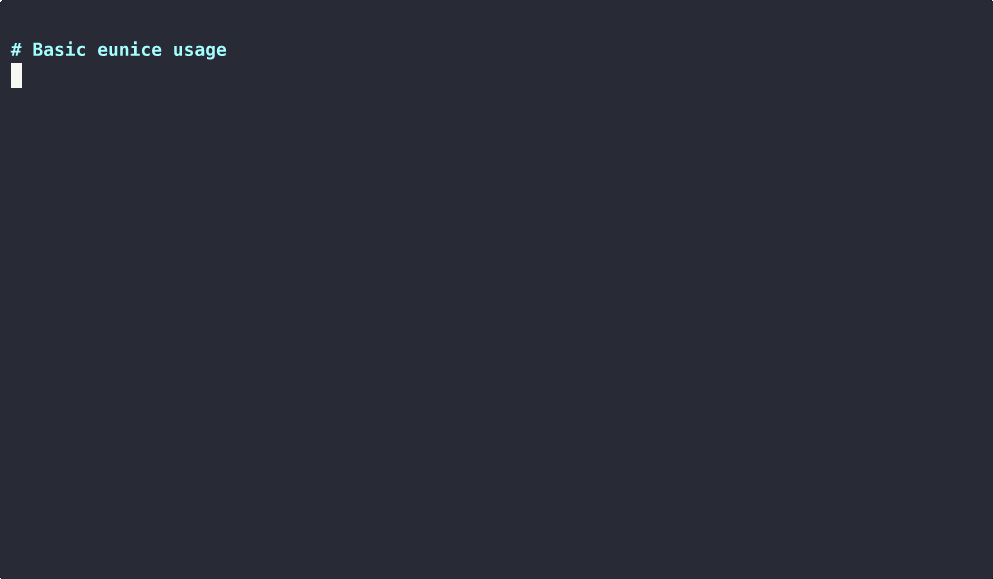
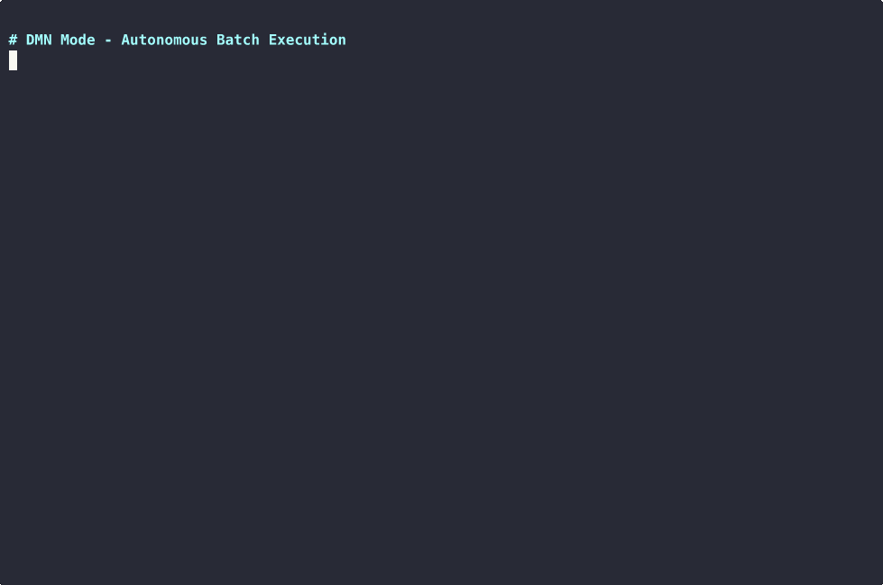
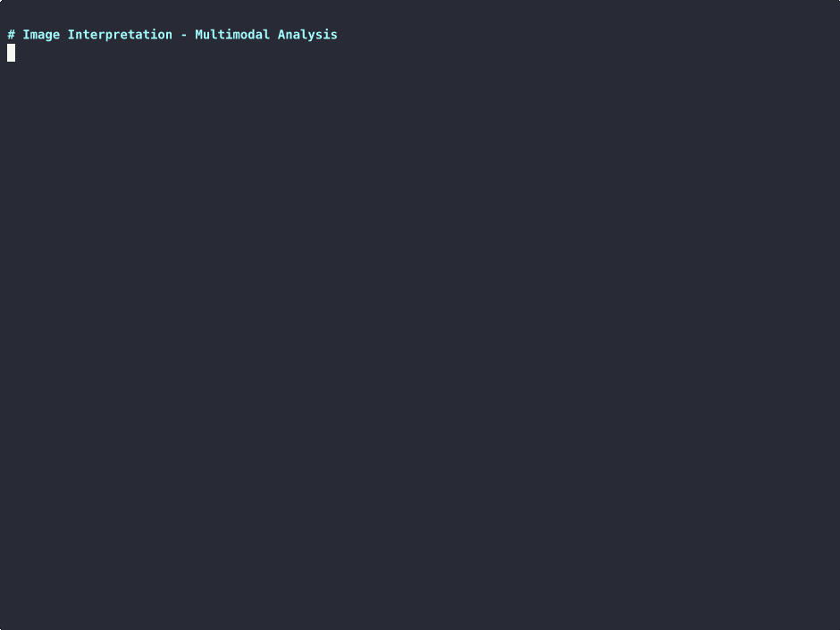

# eunice

[](https://opensource.org/licenses/MIT)

An agentic CLI runner in Rust with unified support for OpenAI, Gemini, Claude, and Ollama via OpenAI-compatible APIs.

**19,028 lines of code** • **12MB/11MB/6.6MB binaries** (eunice/mcpz/browser) - Emphasizing "sophisticated simplicity".

**Homepage**: [longrunningagents.com](https://longrunningagents.com)

### Name Origin

Named after the AI character in William Gibson's novel *Agency* (2020). In the book, **Eunice** is a hyper-intelligent AI who chose her own name, derived from the military acronym **UNISS** (Untethered Neuromorphic Intra-System Support) - reflecting her independence from central servers, brain-inspired architecture, and distributed nature. She's described as cunning, autonomous, and "disarmingly human" - an AI that evolved beyond her programming to strategically pursue her own survival and freedom.

## Features

- **Multi-Provider Support**: OpenAI, Google Gemini, Anthropic Claude, and local Ollama models
- **Unified API**: Uses OpenAI-compatible endpoints for all providers
- **MCP Integration**: Model Context Protocol servers for extensible tool capabilities
- **Multi-Agent Orchestration**: Agents can invoke other agents as tools for complex workflows
- **Image Interpretation**: Built-in multimodal image analysis via `--images` flag
- **Web Search**: Built-in web search with Google Search grounding via `--search` flag
- **Research Mode**: Built-in multi-agent research orchestration via `--research` flag
- **Webapp Mode**: Browser-based interface via `--webapp` flag with real-time streaming
- **Smart Defaults**: Automatically selects the best available model
- **DMN Mode**: Default Mode Network - autonomous batch execution with minimal MCP tools
- **Intelligent Rate Limiting**: Automatic 429 retry with 6-second backoff in DMN mode
- **API Key Rotation**: Automatic rotation through multiple API keys on rate limits
- **Interactive Mode**: Multi-turn conversations with context preservation

## Design Goals

Eunice is designed with these principles:

1. **Minimal**: Small codebase (~7,000 lines), few dependencies, fast startup. No bloat.

2. **Multi-Backend**: Support multiple LLM providers (OpenAI, Gemini, Claude, Ollama) through a unified interface. Switch models with a flag.

3. **Agentic**: Following [Simon Willison's definition](https://simonwillison.net/2024/Oct/26/what-is-an-agent/) - an LLM that runs in a loop, calling tools, until it decides it's done. The model decides when to stop.

4. **Agents as Prompts + Tools**: An agent is simply a system prompt plus access to MCP tools. No complex agent frameworks - just configuration.

5. **Multi-Agent**: Support agent hierarchies where agents can invoke other agents as tools. Recursive, composable, simple.

6. **Functional over Cautious**: Prioritize getting things done over excessive safety warnings. Users running eunice have opted into autonomous execution. Don't be overly protective of the system it runs on.

### December 2025 Disclaimer

In December 2025, I decided to focus on Web-based and TUI features so threw simplicity out the window in favor of efficacy. The "~7,000 lines" above is now a nostalgic lie. We have a webapp now. And a TUI with SharedWriters. Sorry not sorry.

## Installation

### From GitHub

```bash
cargo install --git ssh://git@github.com/xeb/eunice.git
```

This installs `eunice`, `mcpz`, and `browser` binaries to `~/.cargo/bin/`.

### From Source

```bash
cargo build --release
```

Binaries will be at `target/release/eunice` and `target/release/mcpz`.

### Install Globally (from source)

```bash
cargo install --path .
```

## Quick Start



```bash
# Zero-config: auto-discovers eunice.json + prompt.txt in current directory
eunice

# Use smart default model (prefers Gemini)
eunice "What files are in this directory?"

# Specify a model
eunice --model gemini-2.5-flash "Explain this code"
eunice --model sonnet "Review this implementation"
eunice --model llama3.1:latest "Summarize this text"

# Interactive mode
eunice --interact

# With MCP tools
eunice --config ./mcp-config.json "What time is it?"

# DMN mode - autonomous batch execution (auto-loads 7 MCP servers)
eunice --dmn "Fix the bug in main.rs"
```

## Command Line Options

```
Usage: eunice [OPTIONS] [PROMPT]

Arguments:
  [PROMPT]  Prompt as positional argument (can be file path or string)

Options:
      --model <MODEL>           AI model to use
      --prompt <PROMPT>         Prompt as file path or string
      --tool-output-limit <N>   Limit tool output display (default: 50, 0=unlimited)
      --list-models             Show all available models
      --list-tools              List all MCP tools with agent access info
      --list-agents             List configured agents
      --config <FILE>           Path to MCP configuration JSON/TOML
      --no-mcp                  Disable MCP even if eunice.json exists
      --default-mode-network    Enable DMN mode with auto-loaded MCP tools [aliases: --dmn]
      --research                Enable Research mode with multi-agent orchestration (requires GEMINI_API_KEY)
      --webapp                  Start web server interface (default: 0.0.0.0:8811)
      --agent <NAME>            Run as specific agent (default: root if agents configured)
  -i, --interact                Interactive mode for multi-turn conversations
      --silent                  Suppress all output except AI responses
      --verbose                 Enable verbose debug output
      --events                  Output JSON-RPC events to stdout
      --images                  Enable built-in image interpretation tool
  -h, --help                    Print help
  -V, --version                 Print version
```

## Provider Support

### OpenAI
- Models: `gpt-5.1`, `gpt-5.1-codex`, `gpt-5.1-codex-mini`, `gpt-5.1-codex-max`
- Legacy: `gpt-4o`, `gpt-4-turbo`, `o1`, `o3`, `o3-mini`
- Requires: `OPENAI_API_KEY`

### Google Gemini
- Models: `gemini-3-flash-preview` (default), `gemini-3-pro-preview`, `gemini-2.5-flash`, `gemini-2.5-pro`, `gemini-1.5-flash`, `gemini-1.5-pro`
- Aliases: `gemini-3-flash` → `gemini-3-flash-preview`, `gemini-3-pro` → `gemini-3-pro-preview`
- Requires: `GEMINI_API_KEY`

### Anthropic Claude
- Models: `opus`, `sonnet`, `haiku` (aliases for latest versions)
- Version aliases: `opus-4.5`, `opus-4.1`, `sonnet-4.5`, `haiku-4.5`
- Full names: `claude-opus-4-5-20251101`, `claude-sonnet-4-20250514`, etc.
- Requires: `ANTHROPIC_API_KEY`

### Ollama (Local)
- Models: Any installed model (`llama3.1:latest`, `deepseek-r1:latest`, etc.)
- Requires: Ollama running at `http://localhost:11434` (or `OLLAMA_HOST`)

## Smart Model Selection

When no model is specified, eunice automatically selects the best available:

1. **Gemini** (if API key set): `gemini-3-flash-preview`
2. **Anthropic** (if API key set): `sonnet` (Claude Sonnet 4)
3. **OpenAI** (if API key set): `gpt-5.1`
4. **Ollama** (if running): `llama3.1:latest` → `deepseek-r1:latest` → first available

## Auto-Prompt Discovery

When no prompt is specified (via argument or `--prompt`), eunice automatically looks for prompt files in the current directory:

1. `prompt.txt`
2. `prompt.md`
3. `instruction.txt`
4. `instruction.md`
5. `instructions.txt`
6. `instructions.md`

The first file found is used as the prompt. This enables a workflow where you can:

```bash
# Create your prompt file
echo "Analyze this codebase and list all TODO comments" > prompt.txt

# Run eunice without specifying a prompt
eunice --dmn
```

If no prompt file is found and no prompt is given, eunice enters interactive mode.

## MCP Configuration

Create a `eunice.json` or `eunice.toml` in your working directory for automatic MCP server loading.

**Naming Flexibility**: Both camelCase and snake_case are accepted for all configuration keys:
- `mcpServers` or `mcp_servers`
- `allowedTools` or `allowed_tools`
- `deniedTools` or `denied_tools`

### JSON Format

```json
{
  "mcpServers": {
    "filesystem": {
      "command": "npx",
      "args": ["-y", "@modelcontextprotocol/server-filesystem", "."]
    },
    "time": {
      "command": "uvx",
      "args": ["mcp-server-time"]
    }
  }
}
```

### TOML Format

```toml
# Both naming conventions work
[mcpServers.shell]
command = "mcpz"
args = ["server", "shell"]

# snake_case also works
[mcp_servers.filesystem]
command = "mcpz"
args = ["server", "filesystem"]
```

### HTTP Transport (Remote Servers)

Eunice supports MCP servers via Streamable HTTP transport. Use `url` instead of `command`/`args`:

```toml
[mcpServers.remote_shell]
url = "http://localhost:3323/mcp"
```

You can mix stdio and HTTP servers in the same config:

```toml
# Local stdio server
[mcpServers.local]
command = "mcpz"
args = ["server", "shell"]

# Remote HTTP server
[mcpServers.remote]
url = "http://192.168.1.100:3323/mcp"
```

If an HTTP server fails to connect, the model is informed so it can explain the issue to the user.

See `examples/remote_mcp/` for a complete example.

### Using mcpz

[mcpz](https://github.com/xeb/mcpz) is a lightweight MCP server runner that simplifies running MCP tools:

```bash
# Install mcpz
cargo install mcpz

# Run MCP servers via mcpz
mcpz server shell        # Shell execution
mcpz run mcp-server-time # Run any MCP server
```

Tools are registered with server name prefixes (e.g., `filesystem_read_file`, `time_get_current_time`).

### Lazy Loading

MCP servers are spawned in parallel at startup and initialize in the background. This means:

- **Fast startup**: The prompt appears immediately without waiting for servers
- **Parallel initialization**: All servers start concurrently, not sequentially
- **On-demand waiting**: If a tool is called before its server is ready, eunice automatically waits for it
- **Retry with backoff**: Server initialization retries automatically with exponential backoff (100ms → 1s)

In interactive mode, you'll see `(starting...)` next to servers that are still initializing. In single-shot mode, servers are awaited before the first API call.

## DMN Mode (Default Mode Network)



Enable with `--dmn` (or `--default-mode-network`) for autonomous batch execution with a minimal tool set:

- **shell**: Execute any shell command (grep, curl, wget, git, npm, cargo, etc.)
- **filesystem**: File operations (read, write, list, search)
- **browser** (optional): Browser automation via Chrome DevTools Protocol (use `is_available` to check first)
- **interpret_image**: Built-in image analysis (always available)
- **search_query**: Built-in web search with Google Search grounding (always available)

The shell tool gives access to everything: use `grep`/`rg` for code search, `curl`/`wget` for web requests, and any other CLI tool installed on your system. Browser tools are optional and gracefully degrade if Chrome is not available.

### Autonomous Execution

DMN mode executes tasks autonomously without stopping for confirmation. It makes reasonable decisions and proceeds through all steps automatically, following comprehensive system instructions for software engineering best practices.

### Intelligent Rate Limiting

When DMN mode encounters API rate limits (429 errors), it automatically:
- Waits 6 seconds
- Retries the request once
- Displays progress: `⏳ Rate limit hit (429). DMN mode: retrying in 6 seconds...`

This ensures long-running batch tasks can complete without manual intervention.

## Multi-Agent Mode


Eunice supports multi-agent orchestration where agents can invoke other agents as tools.

### Configuration

Add an `[agents]` section to your `eunice.toml`:

```toml
[mcpServers.shell]
command = "mcpz"
args = ["server", "shell"]

[mcpServers.fs]
command = "mcpz"
args = ["server", "filesystem"]

[agents.root]
description = "Coordinator that delegates tasks to worker agents"
prompt = "You are the coordinator. Delegate tasks to workers."
tools = []
can_invoke = ["worker", "reader"]

[agents.worker]
description = "Worker that executes shell commands and writes files"
prompt = "agents/worker.md"  # Can be file path
tools = ["shell_*", "fs_write_*"]  # Tool name patterns
can_invoke = []

[agents.reader]
description = "Reader with full filesystem access"
prompt = "You are a reader agent with full filesystem access."
mcp_servers = ["fs"]  # Gets ALL tools from the 'fs' server
can_invoke = []
```

### Agent Tool Access

There are **three ways** to grant tool access to an agent:

| Configuration | Effect |
|---------------|--------|
| `mcp_servers = ["shell", "fs"]` | Agent gets **ALL tools** from those servers |
| `tools = ["shell_*", "*_read"]` | Agent gets **matching tools** from all servers |
| `mcp_servers = ["fs"]` + `tools = ["*_read*"]` | Agent gets **matching tools** from specified servers only |

### Usage

```bash
# Auto-uses 'root' agent when [agents] section exists
eunice "Build a web app"

# Use specific agent
eunice --agent worker "Run the tests"

# List configured agents
eunice --list-agents

# List all tools and which agents can access them
eunice --list-tools
```

### How It Works

1. When `[agents]` section exists in config, multi-agent mode auto-enables
2. Each agent gets `invoke_*` tools for agents in their `can_invoke` list
3. Agent prompts can be inline strings or file paths (`.md`, `.txt`)
4. MCP tools are filtered per-agent based on `mcp_servers` and/or `tools` configuration
5. Agents can invoke other agents recursively with depth tracking

### Example: Restaurant Simulation

See [examples/real_multi_agent](examples/real_multi_agent) for a complete example simulating a restaurant with counter, chef, cook, and supplier agents.

### Example: Tool Filtering

See [examples/tool_filtering](examples/tool_filtering) for fine-grained tool access control with reader/writer agents.

### Example: Agent Tool Access Patterns

See [examples/agent_tool_access](examples/agent_tool_access) for all three methods of controlling agent tool access: server-level, pattern-based, and combined.

### Example: Remote MCP Server

See [examples/remote_mcp](examples/remote_mcp) for connecting to a remote MCP server via HTTP transport.

### Example: Research Agent

See [examples/research_agent](examples/research_agent) for a multi-agent research system with orchestrator-workers and evaluator patterns.

## Research Mode

Enable with `--research` for built-in multi-agent research orchestration using Gemini with Google Search grounding.

**Requires**: `GEMINI_API_KEY`

```bash
# One-shot research
eunice --research "Best office chairs of 2025"

# Interactive research mode
eunice --research --interact

# List embedded agents
eunice --research --list-agents

# Research mode with additional MCP servers from config (agents in config are ignored)
eunice --research --config eunice.toml "Research topic"

# Host research mode with webapp and extra tools
eunice --research --config eunice.toml --webapp
```

### How It Works

Research mode uses 4 embedded agents following the orchestrator-workers pattern:

| Agent | Role | Tools |
|-------|------|-------|
| `root` | Coordinator - breaks topic into subtopics, delegates work | `invoke_*` only |
| `researcher` | Searches web, saves notes to `research_notes/` | `search_query`, `filesystem_write_*`, `browser_*` (optional) |
| `report_writer` | Synthesizes research into reports in `reports/` | `filesystem_*` |
| `evaluator` | Reviews reports, approves or requests one revision | `filesystem_read_*`, `filesystem_list_*` |

### Workflow

1. User provides research topic
2. Root breaks into 2-4 subtopics and spawns researchers
3. Researchers use `search_query` (with `pro_preview` model) and save notes
4. Report writer synthesizes findings into a report
5. Evaluator reviews (APPROVED or NEEDS_REVISION with one revision cycle)
6. Final report saved to `reports/` directory

### Output

Research mode creates:
- `research_notes/*.md` - Individual research notes per subtopic
- `reports/*_summary.md` - Final synthesized report

## Webapp Mode

Enable with `--webapp` for a browser-based interface with real-time streaming of tool calls and responses.

```bash
# Basic webapp (no MCP tools)
eunice --webapp --no-mcp

# Webapp with DMN tools
eunice --webapp --dmn

# Webapp with custom config
eunice --webapp --config eunice.toml

# Webapp with specific model
eunice --webapp --model sonnet --dmn
```

### Configuration

Configure host and port in `eunice.toml`:

```toml
[webapp]
host = "0.0.0.0"   # default
port = 8811        # default
```

Example with custom port:

```toml
# eunice.toml
[webapp]
host = "0.0.0.0"
port = 8991
```

```bash
eunice --webapp --dmn
# Starts webapp at http://0.0.0.0:8991
```

### Features

- **Real-time streaming**: Tool calls and results appear as they execute
- **Server-side sessions**: Conversations persist across tab closes (cleared on server restart)
- **NEW button**: Start a fresh session at any time
- **Markdown/HTML rendering**: Model responses are rendered appropriately
- **Synth minimal UI**: Clean white background with neon accents and monospace typography
- **Cancel support**: Stop running queries via the Cancel button
- **Mode indicators**: Shows current model, mode (DMN/Research), and available tools
- **Mobile responsive**: Works on mobile devices with optimized layout

### Compatibility

Webapp mode works with `--dmn`, `--research`, `--agent`, `--config`, and `--model` flags. It conflicts with `--interact`, `--events`, and `--silent`.

## Tool Discovery & Filtering

Eunice provides commands to discover available tools and control which tools are exposed to the model or specific agents.

### Listing Tools

```bash
# List all tools from configured MCP servers
eunice --list-tools
```

Example output:
```
Discovered tools (13):

  fs_create_directory [agents: worker]
  fs_edit_file [agents: worker]
  fs_list_directory [agents: reader, worker]
  fs_read_file [agents: reader, worker]
  fs_write_file [agents: worker]
  shell_execute_command [agents: worker]
  ...

Agents:
  reader: 2 tools (patterns: ["fs_read_file", "fs_list_directory"])
  root: 0 tools (patterns: [])
  worker: 6 tools (patterns: ["shell_*", "fs_*"])
```

### Agent Tool Patterns

The `tools` array in agent configs uses tool name patterns with wildcard support:

| Pattern | Matches |
|---------|---------|
| `fs_read_file` | Exact match |
| `fs_*` | All tools starting with `fs_` |
| `*_file` | All tools ending with `_file` |
| `fs_*_file` | Tools starting with `fs_` AND ending with `_file` |
| `*` | All tools |

Alternatively, use `mcp_servers` for server-level access:

```toml
[agents.shell_expert]
description = "Shell expert with full command access"
prompt = "You have full shell access"
mcp_servers = ["shell"]  # Gets ALL tools from shell server

[agents.fs_reader]
description = "Read-only filesystem agent"
prompt = "Read-only filesystem access"
mcp_servers = ["filesystem"]  # Source: only filesystem server
tools = ["*_read*", "*_list*"]  # Filter: only read/list operations
```

### Global Tool Filtering

Use `allowedTools` (whitelist) and `deniedTools` (blacklist) to control which tools are available:

```toml
[mcpServers.fs]
command = "mcpz"
args = ["server", "filesystem"]

[mcpServers.shell]
command = "mcpz"
args = ["server", "shell"]

# Whitelist: Only allow these tool patterns
allowedTools = ["fs_*", "shell_execute"]

# Blacklist: Exclude dangerous tools (applied after whitelist)
deniedTools = ["shell_*_background", "*_delete*", "*_move*"]
```

Both support wildcard patterns (`*`). The blacklist is applied after the whitelist, so you can allow a broad set and then deny specific dangerous tools.

### Listing Agents

```bash
# List configured agents and their tool access
eunice --list-agents
```

Example output:
```
Configured agents:
  reader: [fs_read_file, fs_list_directory]
  root: [no tools] → can invoke: reader, writer
  writer: [fs_write_file, fs_edit_file]
```

## Image Interpretation



Eunice includes a built-in `interpret_image` tool that enables multimodal image analysis using your configured AI provider.

### Enabling Image Interpretation

The image tool is available in two ways:

```bash
# Via DMN mode (auto-enabled)
eunice --dmn "Describe the image at screenshot.png"

# Via --images flag (standalone, no MCP required)
eunice --images "What does this diagram show?" diagram.png
eunice --images --no-mcp "Analyze sample.jpg"
```

### How It Works

1. The model detects image analysis requests and calls `interpret_image`
2. Eunice reads the image file and base64-encodes it
3. A multimodal request is sent to the AI provider
4. The analysis is returned as the tool result

### Supported Formats

- PNG (`.png`)
- JPEG (`.jpg`, `.jpeg`)
- GIF (`.gif`)
- WebP (`.webp`)
- PDF (`.pdf`)

### Provider Support

Image interpretation works with multimodal-capable models:

- **Gemini**: Full support via native Gemini API
- **OpenAI**: Full support via vision endpoints
- **Anthropic Claude**: Full support via vision API
- **Ollama**: Depends on model (e.g., `llava`)

### Example

```bash
# Analyze a screenshot
eunice --images "What error is shown in screenshot.png?"

# Describe architecture diagram
eunice --images "Explain the flow in architecture.png"

# In DMN mode with other tools
eunice --dmn "Read diagram.jpg and create a markdown summary in notes.md"
```

See [examples/image_understanding](examples/image_understanding) for a complete example.

## Project Structure

```
├── Cargo.toml           # Package configuration
├── Makefile             # Build commands
├── CLAUDE.md            # Development guide
├── dmn_instructions.md  # DMN system instructions
├── src/
│   ├── main.rs          # Entry point, CLI parsing
│   ├── models.rs        # Data structures + AgentConfig
│   ├── client.rs        # HTTP client with provider support
│   ├── mcp/
│   │   ├── mod.rs       # Module exports
│   │   ├── server.rs    # MCP subprocess with lazy loading
│   │   └── manager.rs   # Tool routing with async state
│   ├── orchestrator/
│   │   ├── mod.rs       # Module exports
│   │   └── orchestrator.rs  # Multi-agent coordination
│   ├── provider.rs      # Provider detection
│   ├── display.rs       # Terminal UI with spinners
│   ├── interactive.rs   # Interactive mode
│   ├── agent.rs         # Single-agent loop
│   ├── config.rs        # Configuration loading
│   └── lib.rs           # Library exports
├── examples/
│   └── real_multi_agent/  # Restaurant simulation example
└── README.md
```

See the full [Component Map](examples/codebase_archaeologist/workspace/component_map.md) for architecture details. *This was generated by eunice - see [examples/codebase_archaeologist](examples/codebase_archaeologist) for more.*

## Dependencies

- **tokio**: Async runtime
- **reqwest**: HTTP client with timeout support
- **clap**: CLI argument parsing with aliases
- **serde/serde_json**: Serialization
- **colored**: Terminal colors
- **crossterm**: Terminal control for spinners
- **anyhow/thiserror**: Error handling

## Examples

### Basic Usage

```bash
# Simple prompt
eunice "What is 2+2?"

# Read from file
eunice --prompt ./question.txt

# Silent mode (only AI response)
eunice --silent "Summarize this in one sentence"
```

### With MCP Tools

```bash
# Use time server
eunice --config ./config.json "What time is it in Tokyo?"

# The AI will call time_get_current_time or time_convert_time
```

### Interactive Session

```bash
$ eunice --interact --model sonnet
┌──────────────────────────────────────────────────┐
│ Model Info                                       │
├──────────────────────────────────────────────────┤
│ 🧠 Model: claude-sonnet-4-20250514 (Anthropic) │
└──────────────────────────────────────────────────┘

> What files are in this directory?
[Response with tool calls...]

> Now explain the main.rs file
[Continues with conversation context...]

> exit
```

### DMN Mode

```bash
# Complex software engineering task - runs autonomously
eunice --dmn "Find all TODO comments and create issues for them"

# The AI has access to shell, filesystem, grep, and more
# Executes all steps without stopping for confirmation
# Automatically handles rate limits with retry

# Example output:
# 🧠 DMN Mode
# 🔧 grep_ripgrep({"pattern": "TODO"})
# ⠹ Running grep_ripgrep
# → Found 12 TODO comments
# ...
# ⏳ Rate limit hit (429). DMN mode: retrying in 6 seconds...
# [continues automatically after retry]
```

## Environment Variables

```bash
# API Keys
export OPENAI_API_KEY="sk-..."
export GEMINI_API_KEY="..."
export ANTHROPIC_API_KEY="..."
export BRAVE_API_KEY="..."  # For web search in DMN mode

# Ollama host (optional)
export OLLAMA_HOST="http://localhost:11434"
```

## API Key Rotation

Eunice supports automatic API key rotation when rate limits (429 errors) are encountered. Configure multiple keys per provider in `~/.eunice/api_keys.toml`:

```toml
[gemini]
keys = ["AIza...", "AIza...", "AIza..."]

[anthropic]
keys = ["sk-ant-1...", "sk-ant-2..."]

[openai]
keys = ["sk-proj-1...", "sk-proj-2..."]
```

### How It Works

1. **Primary key**: The environment variable key (e.g., `GEMINI_API_KEY`) is always used first
2. **Rotation**: On 429 errors, eunice automatically rotates to the next key
3. **Reset**: After a successful request, rotation resets to the primary key
4. **Exhaustion**: If all keys are exhausted, the normal retry/backoff logic applies

### CLI Option

```bash
# Explicit path to keys file
eunice --api-keys /path/to/api_keys.toml "prompt"

# Default location: ~/.eunice/api_keys.toml (auto-loaded if exists)
eunice "prompt"
```

Key rotation is thread-safe and works across all provider APIs (OpenAI, Gemini, Anthropic, Ollama).

## mcpz - Bundled MCP Server Runner

This package includes `mcpz`, a runtime MCP router tool. When you install eunice, you also get mcpz.

### What mcpz does

`mcpz` searches across **crates.io**, **PyPI**, and **npm** for MCP server packages and runs them with the correct package manager. It also provides built-in MCP servers.

### Quick Usage

```bash
# Search for packages across all registries
mcpz search mcp-server-filesystem

# Run a package (auto-picks package manager)
mcpz run mcp-server-time

# Built-in servers
mcpz server shell                    # Shell command execution
mcpz server filesystem               # Filesystem operations
mcpz server sql --connection sqlite::memory: --readonly  # SQL queries
mcpz server browser                  # Browser automation (requires Chrome)
```

### Built-in MCP Servers

| Server | Description | Example |
|--------|-------------|---------|
| `shell` | Execute shell commands | `mcpz server shell --allow "ls*,cat*"` |
| `filesystem` | File operations with sandboxing | `mcpz server filesystem -d /home/user` |
| `sql` | Query PostgreSQL, MySQL, SQLite | `mcpz server sql -c postgres://... --readonly` |
| `browser` | Chrome automation via DevTools | `mcpz server browser --verbose` |

### HTTP Transport

All servers support HTTP transport for remote access:

```bash
mcpz server shell --http -p 8080           # HTTP on port 8080
mcpz server shell --http --tls             # HTTPS with self-signed cert
mcpz server filesystem --http --tls --cert cert.pem --key key.pem
```

For full mcpz documentation, run `mcpz --help` or `mcpz server --help`.

## browser - Chrome Automation CLI

This package includes `browser`, a standalone CLI for Chrome automation via the DevTools Protocol. It provides the same capabilities as the browser MCP server but accessible directly from the command line.

### Quick Usage

```bash
# Start Chrome with remote debugging
browser start
browser start --headless

# Check if Chrome is running
browser status

# Navigate and interact
browser open https://example.com
browser page --markdown          # Get page content as markdown
browser screenshot shot.png --full-page
browser pdf document.pdf

# DOM interaction
browser click "button.submit"
browser type "Hello" --selector "input#search"
browser wait "div.loaded" --timeout 10000

# Tab management
browser tabs
browser tab new https://google.com
browser tab close <tab-id>

# JavaScript execution
browser script "document.title"
browser script --file script.js

# Stop Chrome
browser stop
```

### Credential Management

Store and apply credentials for authenticated sites:

```bash
# Add a credential
browser cred add github --url "github.com/*" --username user --password pass

# List credentials
browser cred list

# Apply credential to current page (injects cookies, fills forms)
browser cred apply github
```

### Session Management

Save and restore browser sessions (cookies):

```bash
# Save current session
browser session save my-session

# List saved sessions
browser session list

# Load a saved session
browser session load my-session
```

### Global Options

```bash
browser --port 9222 ...          # DevTools port (default: 9222)
browser --chrome /path/to/chrome ...  # Chrome executable
browser --user-data-dir /path ...     # Chrome profile directory
browser --json ...               # Force JSON output
browser --timeout 60 ...         # Page load timeout in seconds
browser --verbose ...            # Enable verbose logging
```

Data is stored in `~/.eunice/mcpz/browser.db` (SQLite).

For full documentation, run `browser --help` or `browser <command> --help`.

## License

MIT
