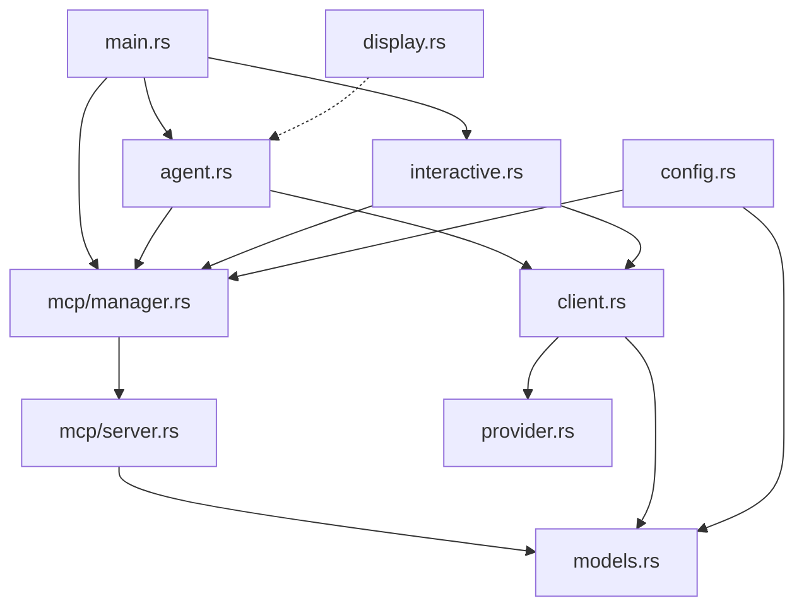

# Component Map



## Component Status

| Component | Status | Lines | Last Analyzed |
|-----------|--------|-------|---------------|
| `src/` (core) | ✅ Explored | ~2.4k | 2025-11-26 |
| `src/mcp/` | ✅ Deep dive | 628 | 2025-11-26 |
| `src/client.rs` | 🔍 Needs deep dive | 706 | - |
| `examples/` | ⏳ Pending | - | - |

## Data Flow

```
User Input
    │
    ▼
┌─────────────────┐
│   main.rs       │ (CLI parsing, mode selection)
└────────┬────────┘
         │
    ┌────┴────┐
    ▼         ▼
┌───────┐ ┌───────────┐
│ Agent │ │Interactive│  (DMN mode vs Chat mode)
└───┬───┘ └─────┬─────┘
    │           │
    └─────┬─────┘
          ▼
    ┌───────────┐
    │  Client   │  (LLM API abstraction)
    └─────┬─────┘
          │
    ┌─────┴─────┐
    ▼           ▼
┌────────┐  ┌──────────┐
│ OpenAI │  │  Gemini  │  (Provider-specific handling)
│  API   │  │ Native   │
└────────┘  └──────────┘

Tool Execution Path:
Agent → McpManager → McpServer (child process) → JSON-RPC → Tool Result
```
