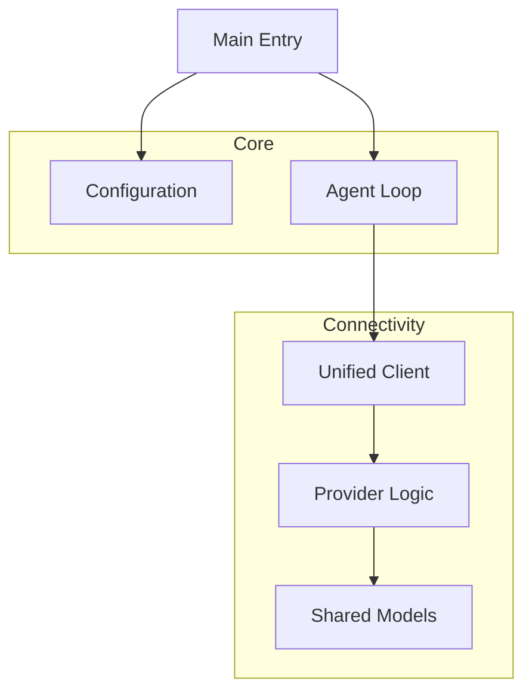

# Component Map

## Components
- **Main Entry**: Application bootstrap.
- **Agent Loop**: Core DMN autonomous loop.
- **Configuration**: Settings and environment management.
- **Unified Client**: HTTP transport to LLMs.
- **Provider Logic**: Model detection and API normalization.
- **Shared Models**: Data structures for API communication.
